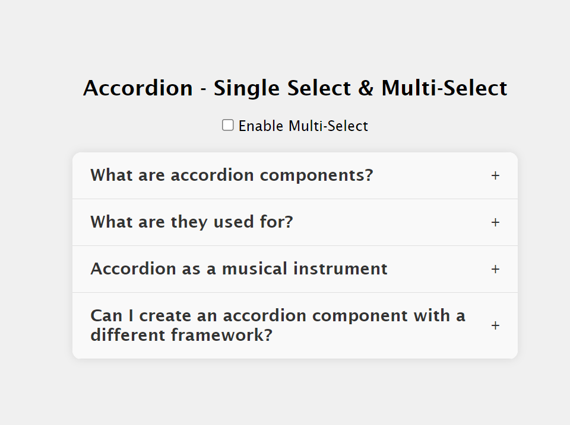
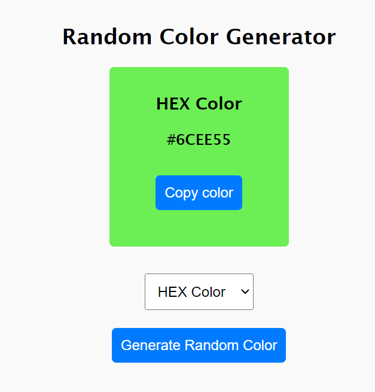
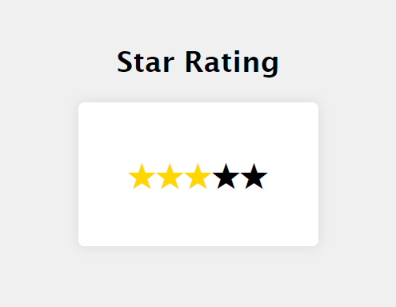

# The Art of React JS Mastery 🚀

Welcome to "The Art of React JS Mastery" repository! This repo showcases various React components and techniques to master React.js. Each project demonstrates different aspects of React functionality, from simple UI components to more advanced interactions.

## Project 01: Accordion - Single & Multi Select

### Overview
The Accordion project demonstrates a common UI pattern where multiple sections of content can be collapsed or expanded independently. It supports both single and multi-select modes.

### Features
- Single and multi-select modes
- Clean and intuitive UI design
- Smooth transition animations

### Links
[Project Repository](https://github.com/Miraj8280/the-art-of-reactjs-mastery/tree/main/src/components/01_accordion) || [Live Preview](https://the-art-of-reactjs-mastery.vercel.app/)

## Project 02: Random Color Generator

### Overview
The Random Color Generator project generates random colors with each click, providing RGB and HEX types.

### Features
- Generates random colors on click
- Generates RGB or HEX color
- Copy color code to clipboard

### Links
[Project Repository](https://github.com/Miraj8280/the-art-of-reactjs-mastery/tree/main/src/components/02_color-generator) || [Live Preview](https://the-art-of-reactjs-mastery.vercel.app/)

## Project 03: Star Rating

### Overview
The Star Rating project allows users to rate items using a star-based system, providing visual feedback on their selection.

### Features
- On hover star rating
- on click sets the rating
- Simple UI

### Links
[Project Repository](https://github.com/Miraj8280/the-art-of-reactjs-mastery/tree/main/src/components/03_star-rating) || [Live Preview](https://the-art-of-reactjs-mastery.vercel.app/)

Happy coding! 🎨✨
